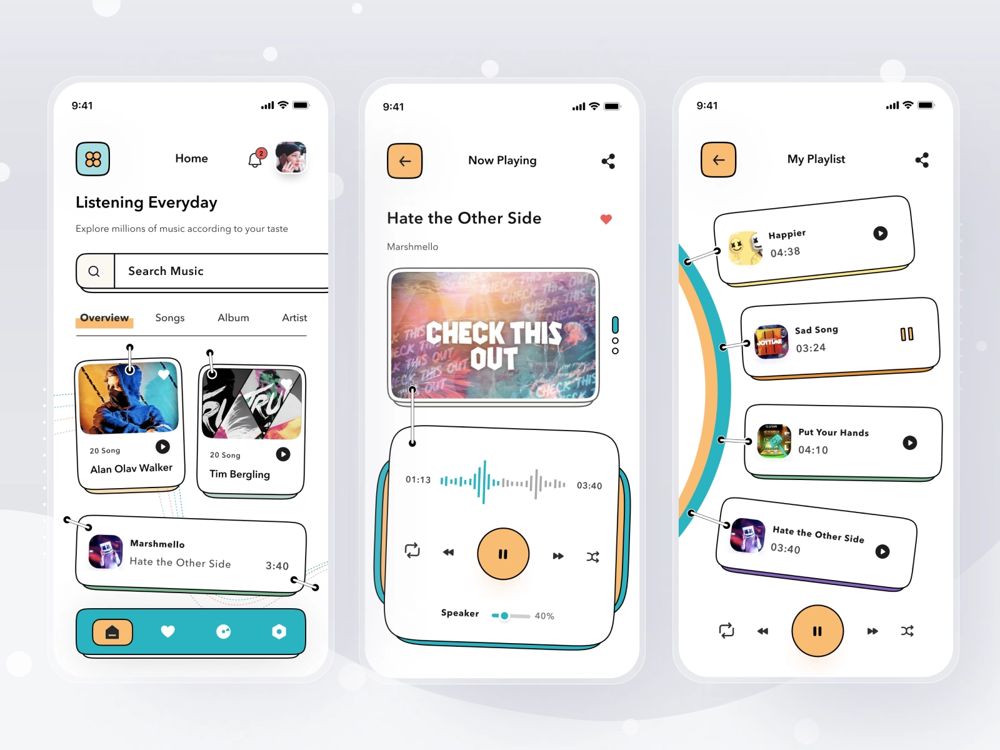

# unusable_player
Unusable Player is a flutter music player based on just_audio package.
It's a portfolio project, it's not meant to be used in real life.
Its focuses on visuals instead of usability and performance, that's why the project is called "Unusable Player".
This project takes inspiration from Sulton Handaya's artwork:

# Roadmap

- [ ] Flutter 3.0
- [ ] iOS support
- [ ] Language switch
- [ ] build release version for Android/iOS
- [ ] add some screens/vids of the app in the readme

# Caution
This project isn't representative of my actual coding standards.
If you take inspiration from this source code, keep a critical eye. Some parts of this project are better than others.
If I should restart this project today, I would:
- Use Bloc (and state_machine_bloc 😏) instead of GetX
- Use a feature-based project organization
- Re-write the animations widgets to make them less hacky
- Rethink the overall songs discovery and player architecture
In short, almost everything. It was a nice learning project, I will finish it but I do not plan to start working on a v2.0.